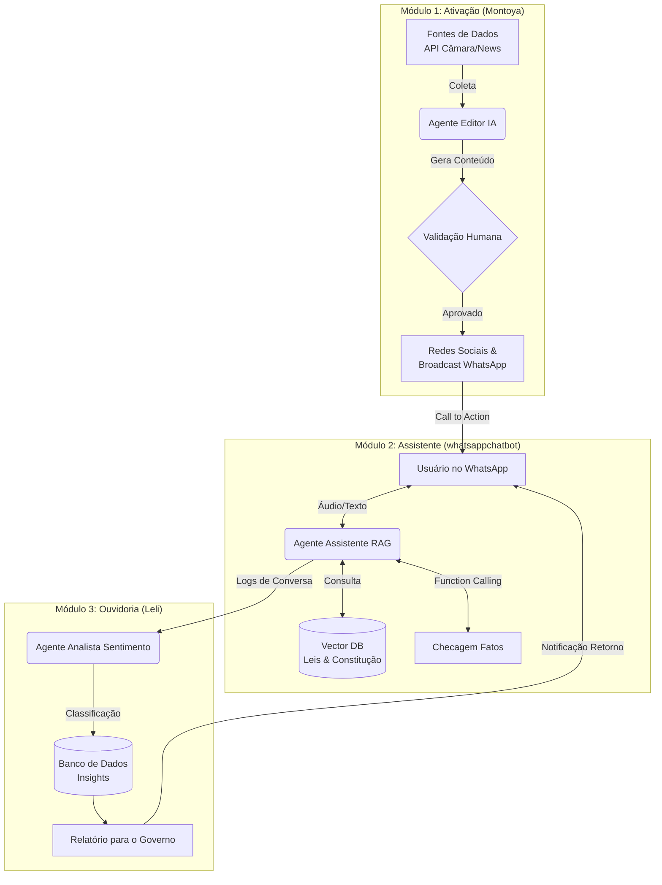

# 🇧🇷 Tá Certo Isso? - Hackathon Devs de Impacto

> **Missão:** Quebrar a barreira da apatia política transformando o "juridiquês" em papo reto no WhatsApp, gerando engajamento cívico real e ouvidoria inteligente.

## 🎯 O Problema

O brasileiro médio não confia na política, não entende as leis e se sente impotente. A informação chega distorcida (fake news) ou complexa demais (Diário Oficial).

## 💡 A Solução

Uma plataforma integrada que **Ativa** o cidadão com notícias traduzidas, **Assiste** através de um chat interativo com IA no WhatsApp e **Ouve** o sentimento popular para gerar relatórios de impacto.

Toda a malha de dados fica centralizada em um MongoDB hospedado em Azure Container Instances + Azure Files, garantindo histórico único das conversas do WhatsApp para alimentar o módulo Leli e qualquer dashboard analítico futuro.

## Deploy

- **Bot (Nichols)**: publicado no Azure App Service (vide `infra/main.bicep` e `.github/workflows/ci-azure.yml`).
- **Mongo (dados)**: o IaC provisiona um container MongoDB no Azure (ACI + Azure Files). Basta definir `mongoAdminPassword` no deploy para ter o endpoint pronto para o bot, Evolution e Leli.
- **Evolution API**: recomendamos rodar em uma VM/VPS própria usando `Nichols/evolution/docker-compose.yml`, que já provisiona Postgres + Redis (exigidos pela Evolution v2) e configura o webhook para `https://hackathonopenai-api.azurewebsites.net/webhook/evolution`. Basta copiar `env.evolution.example`, ajustar `SERVER_URL` / `AUTHENTICATION_API_KEY`, e executar `docker compose -f Nichols/evolution/docker-compose.yml up -d`. Consulte a [documentação oficial](https://doc.evolution-api.com/v2/pt/env) para habilitar recursos extras (Mongo opcional, RabbitMQ, etc).
- **Automação local**: para levantar o túnel HTTPS e acompanhar os logs em um único passo, rode `python Nichols/tools/ngrok_watch.py`. O script inicia `ngrok http 8080`, exibe a URL gerada e segue os logs do serviço `evolution_api` via Docker Compose.
=======
## 🎬 Exemplo de Vídeo Gerado

Exemplo de vídeo criado automaticamente pelo módulo Montoya (IA Sora) a partir de uma proposição legislativa:

[▶️ Assistir ao vídeo (MP4)](https://raw.githubusercontent.com/Ta-Certo-Isso/MonoRepoHackathon/montoya/Montoya/output/videos/sora/run%202/projeto_que_prev_aumentar_valor_do_iptu_de_pinda_d_final.mp4)

---

## 🏗 Arquitetura do MonoRepo

O projeto está dividido em 3 módulos interconectados, operando sobre uma base comum de dados e infraestrutura.

    subgraph "Data Layer"
        J --> L[(MongoDB - Azure Container Instance)]
        G --> L
    end
